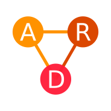

# PeerPub

This software can be used for internal peer review clearance processes of
scientific or other publications. It is primarily targeted to a scientific
audience and reflects common workflows in science.

As this software is open source under GNU AGPLv3, please go ahead and use it.
Please respect the license obligations and restrictions. You should have received
a copy of the AGPLv3 license with this code in the LICENSE file.

## WARNING

This software is still in early stages of development. Please don't use it
for anything real yet. Expect sudden and disruptive changes, unhandled exceptions
and the end of the world due to null pointers.

Anyway: feel free to try it out.

## Requirements
As Peerpub is basically a executable JAR file, you have many options to run this.
Independent from the way you will provide it, please notice the following services
need to be in place before starting the web app:

1. MongoDB v3.6 or newer (used for the data)
2. H2 SQL database for the Camunda BPM process engine
   (so by default no further SQL service needs to be provided by you!)
3. optional: Tomcat Server (vX.X?) with OpenJDK 8 or newer
   (or just use some init system together with the JAR package or
   Docker containers, see below)

Please also read the [notes on data persistance](doc/database.md)
carefully.

## Quick demo instance

This project uses [Maven](https://maven.apache.org) for all stages of
development and [Docker](https://www.docker.com) to run tests and demos.

To run a demo or test instance, please
1. Install [Docker](https://docs.docker.com/install) and [docker-compose](https://docs.docker.com/compose/overview)
2. Install OpenJDK 8 / Oracle JDK 8 or newer and Maven
3. Run `mvn package -DskipUTs` within the cloned peerpub repository.
4. If not already done, start the docker service
5. Run `mvn docker:build`
6. Run `docker-compose up` in the same directory.
7. Point your browser to http://localhost:8080.

## Developing
You will most certainly want to follow the instructions for the demo first.

While developing the application, beware that after changing your source
code, you have to recompile, build a new package, build a new docker
image and cleanup docker if you want to go "full stack":

1. `mvn clean verify docker:build`
2. `docker-compose rm -f app && docker-compose up`

As an alternative, you might be interested in running only the service via
Docker and start the web application outside of docker, so a simple rebuild is sufficient.
This could be especially usefull while testing and developing view templates.

1. In a separate shell, only start needed services: `docker-compose up mongodb`
2. Run `mvn spring-boot:run` to build and start a "development" instance
   (otherwise spring-boot-devtools are not activated)
3. Launch your browser and point it to http://localhost:8080
4. After changing code, assets or other, just let your IDE rebuild the project
5. For even more comfort, install the [LiveReload extension](http://livereload.com/extensions) for your browser.
   It will auto-refresh the page after the rebuild happened.

## License
